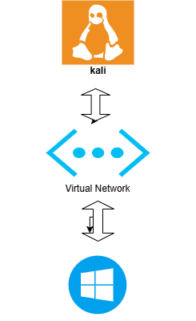

# Home SOC Lab

## About This Project

This repository documents my journey of building a Home Security Operations Center (SOC) Lab from the ground up.

The goal of this lab is to gain hands-on experience in cybersecurity by creating a realistic environment where I can simulate attacks, analyze logs, investigate suspicious activity, and improve my threat hunting and defensive security skills.

Rather than focusing only on theory, this project is centered around practical learning and real-world scenarios.

## Current Setup

* Kali Linux Virtual Machine
* Windows 10 Virtual Machine

## Lab Architecture

## What I Plan to Add

* Sysmon for advanced Windows logging
* Wazuh for monitoring and log analysis
* Threat hunting scenarios
* DDoS detection and investigation
* Active Directory environment
* BloodHound for attack path analysis
* Custom detection rules and alerts

## Goals

* Understand how attackers operate
* Learn how to detect malicious activity
* Improve incident investigation skills
* Gain experience with security monitoring tools
* Build a portfolio of practical cybersecurity projects

## Progress

* [x] Kali Linux VM
* [x] Windows 10 VM
* [x] Sysmon
* [ ] Wazuh
* [ ] Threat Hunting
* [ ] DDoS Detection
* [ ] Active Directory
* [ ] BloodHound

This lab will continue to evolve as I learn new technologies, techniques, and security concepts.

